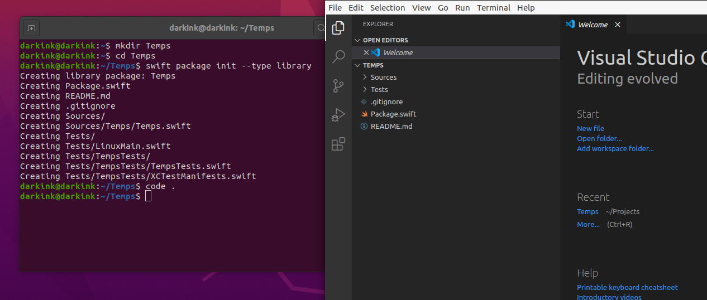
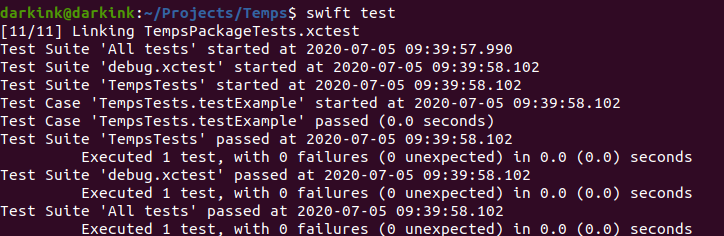

# A New Look at Swift
A few months ago I wrote an application in React to run as a home screen app on my iPhone.
It’s not a complex application but I wanted a more native feel.
I thought I’d re-write it as a native app.
Before running out and buying a Mac, I thought I’d read the Swift book and try a little Swift on the Playgrounds.

In addition to the Playgrounds app, you can download a Linux version of the Swift compiler from Swift.org.
I am running Swift for Linux in a VM on my Windows desktop.
You can follow the instructions from the [Swift](https://swift.org) site to download and configure the compiler.
I will assume you have some programming background.
I think any language is reasonable.

I’m going to create a new library project.
In an empty directory called Temps, I will run:

```bash
swift package init --type library
```

I then open that directory in Visual Studio Code.
I recommend adding the Swift extension from [Martin Kase](https://marketplace.visualstudio.com/publishers/Kasik96).



## Enums
There’s a lot of intentionality to the types in swift.
To see what I mean, let’s dive in with an example.
Let’s start with something like a temperature.
We could just use a double to represent temperature.

```swift
let temp = 50.0
print("Is \(temp) sweater weather or sweating weather?")
```

We have 50 degrees as a simple double.
50 Fahrenheit and 50 Celsius are very different days.
Opening the file at <code>Sources/Temps/Temps.swift</code>, I'll add an enum.
The <code>Scale</code> enum, an enumeration of values, will represent the temperature scales.
If you come from a C++ or C background, enum are usually just integers.
Swift is a lot more flexible.

```swift
enum Scale {
	case celsius, fahrenheit
}
```

## Temperature Type
Using the <code>Scale</code> enum, I then wrap temperature measurement in a struct.
I add the struct below my new enum in the same <code>Sources/Temps/Temps.swift</code> file.
The temperature struct has two members: measurement and scale.
I can now distinguish between a cool fall day and summer in Death Valley.

```swift
struct Temperature {
	let scale: Scale
	let measurement: Double
}
```

Let’s write a simple to test to create a Temperature and make sure everything is okay.
Let's open the <code>Test/TempsTests/TempsTest.swift</code> file.
We clean out the existing methods and start with this.
Our test, <code>simpleTemperature</code>, is just checking that the struct behaves the way we expect.

```swift
import XCTest
@testable import Temps

final class TempsTests : XCTestCase {
	func simpleTemperature() {
		let t = Temperature(scale: .celsius, measurement: 32.0)
		
		XCTAssertEqual(.celsius, t.scale)
		XCTAssertEqual(32.0, t.measurement)
	}

	static var allTests = [
		("simpleTemperature", simpleTemperature)
	]
}
```

When you add test methods to this class, make sure add your tests to the <code>allTest</code> declaration.
The type is a list of tuples representing the name of the test and the class function to execute.
If you look in the <code>XCTestManifests.swift</code> file you'll see how that value is added to the tests to execute.

```swift
static var allTests = [
	(“simpleTemperature”, simpleTemperature)
]
```

We can now run the test.

```bash
swift test
```



## Extensions
It is a little tedious to write <code>Temperature(measurement:72.0, scale: .fahrenheit)</code>.
I don't oppose verbosity when it adds clarity, but we might be wring this a lot.
It would be bett to have something simpler like <code>32.5.degreesCelsisus()</code>.
Here we come to one feature of Swift I found interesting.

You can extend an existing type.
This includes base types like <code>Double</code> and <String>.
That is because the base types aren’t special cases in the type system.
We can define the syntax we'd like in a test called <code>doubleToTemperature</code>.

```swift
func doubleToTemperature() {
	let t1 = 32.0.degreesCelsius()
	let t2 = 32.0.degreesFahrenheit()
	
	XCTAssertEqual(.celsius, t1.scale)
	XCTAssertEqual(32.0, t1.measurement)
	
	XCTAssertEqual(.fahrenheit, t2.scale)
	XCTAssertEqual(32.0, t2.measurement)
}
```

Once again, don't forget to add the test to the collection of declared tests.
Otherwise, it won't run your new test.

```swift
static var allTests = [
	("doubleToTemperature", doubleToTemperature),
	(“simpleTemperature”, simpleTemperature)
]
```

When we run the test, we see that the test fail to compile.
Now let’s implement that extension.
Extensions allow you to add methods to an existing type.
In this case we’re adding the ability to create temperatures from doubles.

```swift
extension Double {
	func degreesCelsius() -> Temperature {
		return Temperature(scale: .celsius, measurement: 0.0)
	}
	
	func degreesFahrenheit() -> Temperature {
		return Temperature(scale: .celsius, measurement: 0.0)
	}
}
```

If we run the tests again, we see that they are compiling now but failing.
We are using dummy values for scale and measurement.
Since we’re adding a method to a <code>Double</code>, the value of the <code>Double</code> is available in the <code>self</code> reference.
We can go and and fix the implementations so they are correct.

```swift
extension Double {
	func degreesCelsius() -> Temperature {
		return Temperature(scale: .celsius, measurement: self)
	}
	
	func degreesFahrenheit() -> Temperature {
		return Temperature(scale: .fahrenheit, measurement: self)
	}
}
```

Now the tests pass.

## Properties
That’s certainly more compact.
It also reads well, meaning if you were to read the code out-loud, it would make sense.
But I don’t like the fact I have to add parens to use that method call.
I’d like something even more compact, like <code>32.0.celsius</code>
Instead of using a method, I can add a property.
I’ll start by writing my test and stubbing out two computed properties.

```swift
func doublePropertiesToTemperature() {
	let t1 = 32.0.celsius
	let t2 = 32.0.fahrenheit
	
	XCTAssertEqual(.celsius, t1.scale)
	XCTAssertEqual(32.0, t1.measurement)
	
	XCTAssertEqual(.fahrenheit, t2.scale)
	XCTAssertEqual(32.0, t2.measurement)
}
```

This is the last time I'll include a reminder to add the test to the list of tests.
From here on in, I'm going to assume you are doing that.

```swift
static var allTests = [
	("doublePropertiesToTemperature", doublePropertiesToTemperature),
	("doubleToTemperature", doubleToTemperature),
	(“simpleTemperature”, simpleTemperature)
]
```

Again, if we run the we see it doesn’t compile.
We can add two computed properties to return the Celsius or Fahrenheit temperature for a <code>Double</code>
We’ll go ahead and re-use the methods we wrote earlier to implement the properties.

```swift
extension Double {
	func degreesCelsius() -> Temperature {
		return Temperature(scale: .celsius, measurement: self)
	}
	
	func degreesFahrenheit() -> Temperature {
		return Temperature(scale: .fahrenheit, measurement: self)
	}
	
	var celsius: Temperature {
		return self.degreesCelsius()
	}
	
	var fahrenheit: Temperature {
		return self.degreesFahrenheit()
	}
}
```

But what if I don’t write the dot-zero on the end of the Double?
For example <code>101.fahrenheit</code>?
Swift sees that number as an integer or <code>Int</code>.
There’s no automatic conversion from an integer to a double.
We haven't yet extended <code>Int</code> with those properties.
I’ll leave that as an exercise to the reader.

## Enum Methods
Now let’s look at converting from one scale to the other.
If it’s 17 Celsius, is that shorts or pants weather?
I’d like to be able to convert it to Fahrenheit.
Where should the formula for converting one to the other be stored?
We could embed that knowledge into the the temperature.
But that doesn’t feel right.
Converting between scales feels like it belongs to the Scales themselves.

I’m going to embed that knowledge into the <code>Scale</code> enumeration.
The scales should know how to covert from one to the other.
Let’s write a little test.
If I have an enum value of Celsius and we want it to convert to Fahrenheit, we’d expect 0 Celsius to be 32 Fahrenheit.
Likewise, if we ask the enum value Fahrenheit to convert 212 to Celsius we should get back 100.

```swift
func scaleConversions() {
	let f = Scale.celsius.toFahrenheit(0.0)
	let c = Scale.fahrenheit.toCelsius(212.0)
	
	XCTAssertEqual(32.0, f)
	XCTAssertEqual(100.0, c)
}
```

I’ll add the initial implementation of the methods to return -1.0.
Notice I’m using the under-score where I would specify the name of the variable.
Normally, Swift uses named parameters.
For example, if we omit the underscore, a caller would have to write:

```swift
let foo = Scale.celsius.toFahrenheit(val: 22.0)
```

There doesn't seem to be much additional information with the name, so I’m going to use the underscore.
But I still need a way to refer to the variable.

```swift
enum Scale {
	case celsius, fahrenheit
	
	func toCelsius(_ val: Double) -> Double {
		return -1.0
	}
	
	func toFahrenheit(_ val: Double) -> Double {
		return -1.0
	}
}
```

When I run the test, it fails.
Now let’s go in and implement the methods.
We’ll use the same formula we learned in grade school.
When I run it I see our two tests pass.

```swift
enum Scale {
	case celsius, fahrenheit
	
	func toCelsius(_ val: Double) -> Double {
		return (val - 32.0) * 5.0/9.0
	}
	
	func toFahrenheit(_ val: Double) -> Double {
		return val * 9.0/5.0 + 32.0
	}
}
```

But there’s a problem.
What if I ask Celsius to convert to Celsius.
Let’s go back and add a test for that.

```swift
func scaleDontConvert() {
	let f = Scale.fahrenheit.toFahrenheit(0.0)
	let c = Scale.celsius.toCelsius(212.0)
	
	XCTAssertEqual(0.0, f)
	XCTAssertEqual(212.0, c)
}
```

If we run that test we get a failure.
Looking at the code, it's obvious.
There needs to be a check to see if the <code>self</code> member is the same as the scale to which we’re converting.
We add an <code>if</code> conditional to check the value of <code>self</code>.
We can just return the raw value if <code>Sale.celsius</code> is being asked to convert to Celsius.
Likewise for fahrenheit.
Now if we run our tests, we see that it is correct.

```swift
enum Scale {
	case celsius, fahrenheit
	
	func toCelsius(_ val: Double) -> Double {
		if self == .celsius {
			return val
		}
		return (val - 32.0) * 5.0/9.0
	}
	
	func toFahrenheit(_ val: Double) -> Double {
		if self == .fahrenheit {
			return val
		}
		return val * 9.0/5.0 + 32.0
	}
}
```

Let’s now add conversion to the temperature struct.
We can use a computed property just like the extension for <code>Double</code>.
We’ll start by writing a test for the behavior.
Given a temperature in celsius, return that value in Fahrenheit vice-versa.


```swift
func temperatureConvert() {
	let t1c = 0.0.celsius
	let t2f = 212.0.fahrenheit
	
	let t1Converted = t1c.fahrenheit
	let t2Converted = t2f.celsius
	
	XCTAssertEqual(32.0, t1Converted.measurement)
	XCTAssertEqual(.fahrenheit, t1Converted.scale)
	
	XCTAssertEqual(100.0, t2Converted.measurement)
	XCTAssertEqual(.celsius, t2Converted.scale)
}
```
We can add the implementation onto Temperature.
Let’s start by returning the temperature as 0.0 with the wrong scale for both.
When we run this we get a failure.

```swift
struct Temperature {
	let scale: Scale
	let measurement: Double
	
	var celsius: Temperature {
		return 0.0.fahrenheit
	}
	
	var fahrenheit: Temperature {
		return 0.0.celsius
	}
}
```

Now let’s implement the properties.
Since the scale knows how to convert itself, the answer is trivial.
We use the current scale to convert the value to the expected value in celsius or Fahrenheit.
Since the result of the scale conversion is a <code>Double</code>, we can use our extension to convert it to a <code>Temperature</code>.
Run tests and we should see it pass.

```swift
struct Temperature {
	let scale: Scale
	let measurement: Double
	
	var celsius: Temperature {
		return scale.toCelsius(measurement).celsius
	}
	
	var fahrenheit: Temperature {
		return scale.toFahrenheit(measurement).fahrenheit
	}
}
```

## Protocols
Both <code>Double</code> and <code>Temperature</code> have the same set of computed properties.
You can think of them as having joined the same club.
We can abstract that concept in something called a <code>protocol</code>.
It’s like an interface, if your coming from a language like Java or C#.
Let’s go ahead and declare a <code>Convertible</code> protocol with the two computed properties.

```swift
protocol Convertible {
	var celsius: Temperature
	var fahrenheit: Temperature
}
```

If you’re coming from a language like Java, it’s obvious how you’d just add the protocol definition to Temperature.

```swift
struct Temperature : Convertible {
	let scale: Scale
	let measurement: Double
	
	var celsius: Temperature {
		return scale.toCelsius(measurement).celsius
	}
	
	var fahrenheit: Temperature {
		return scale.toFahrenheit(measurement).fahrenheit
	}
}
```
	
What’s less obvious is you can add the protocol definition to Double by adding it to the extension definition.
This means that the type <code>Double</code> has the <code>Convertible</code> superpower.

```swift
extension Double : Convertible {
	func degreesCelsius() -> Temperature {
		return Temperature(scale: .celsius, measurement: self)
	}
	
	func degreesFahrenheit() -> Temperature {
		return Temperature(scale: .fahrenheit, measurement: self)
	}
	
	var celsius: Temperature {
		return self.degreesCelsius()
	}
	
	var fahrenheit: Temperature {
		return self.degreesFahrenheit()
	}
}
```

Why would we do this?
Let’s write a function to get the average temperature in Celsius.
As we can see, the array of <code>Convertible</code> elements includes temperatures and Doubles.
Printing all these as Celsius temperature reading is simple.
Let’s add the example code as if it were a test.

```swift
func notATest() {
	let someRandomReadings: [Convertible] = [32.0, 40.0.celsius, 22.0, 55.0.fahrenheit]
	for reading in someRandomReadings() {
		print(reading.celsius)
	}
}
```

## Classes
Let’s talk about why there wasn’t a <code>Temperature</code> class.
Swift has reference and value types.
All temperature readings of 72.0 degrees Celsius are the same.
That lends itself to a value type, like a <code>Double</code> or a <code>String</code>.

References are things that are unique enough that we want to track a specific copy.
This is especially true if you want multiple data structers to hold a reference to the same data in memory.
Many object oriented languages encourage the use of reference types when value types would be a better fit.

Memory allocation for value types is on the stack.
When the function returns, all the value types are automatically cleaned up.
Allocating new copies of the value type is cheap because it's just memory on the stack.
Whereas reference types are managed by counting the active references to that type.
They can only be deallocated when their reference count is zero.

## Mutability
I also made the members read only.
The values are set when the <code>Temperature</code> structer is intialized and can't be changed.
I could have made them mutable and convert could update members of the temperature struct.
But it’s easier to reason about immutable values.
I don’t want to introduce a bug where someone updates the scale but not the measurement or vice-versa.

## Conclusion
What’s my initial take on Swift?
When I first saw the language and tried out some simple examples, I didn’t care for it.
That was some time ago and I hadn’t read the Swift book from Apple (free on iBooks).
Maybe it's because I've taken a more serious look or the language has improved, but I like it.
To me it is a good evolution Objective-C, a language with which I was familiar.
It has good ergonomics, is consistent, and verbose in a meaningful way.

There are some drawbacks.
Outside of the Apple universe there isn’t much Swift usage.
There is a [server working group](https://swift.org/server/).
It is available on Linux but not well curated for Windows.
The surrounding tooling is not developed as it is for Go (for example).
Maybe if JetBrains published AppCode to run on Linux?

This does not mean Swift doesn’t have a very well developed standard library.
It bridges to Objective-C, which has had close to 40 years of development.
For example, while temperatures are an interesting learning example, there is a [NSMeasurement](https://developer.apple.com/documentation/foundation/nsmeasurement) framework.
It includes temperatures.

Anyway, I’d like to get a few more of these out.
See you around!
